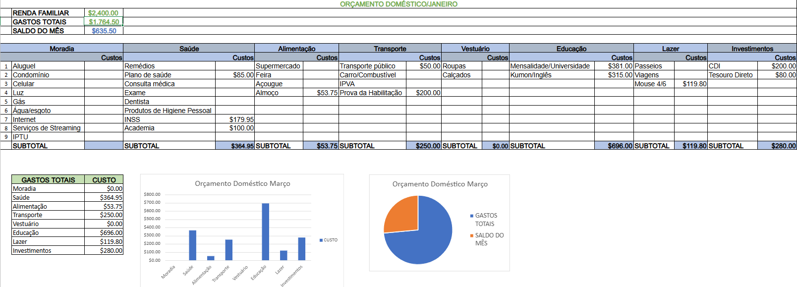

# 📊 Dashboard Domestico em Excel

Projeto de análise de dados utilizando Excel.

## Objetivo
Analisar desempenho de gastos por:
- Educação
- Saúde
- Investimentos
- Transporte

## Ferramentas utilizadas
- Excel
- Tabela dinâmica
- Gráficos
- Segmentação de dados

## Preview do Dashboard

## Arquivo do Projeto
O arquivo completo está disponível em:

dashboard.xlsx
